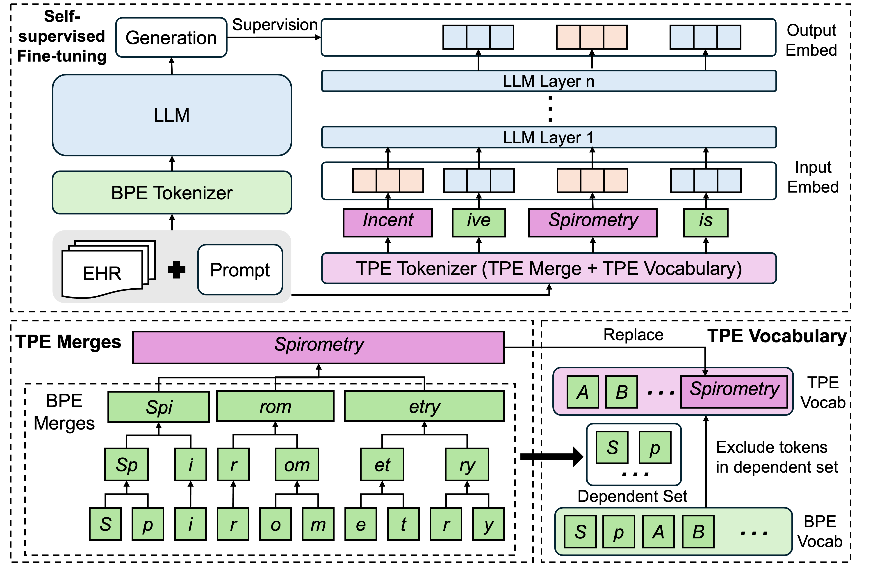

# MedTPE: Compressing Long Electronic Health Record Sequencesfor Large Language Models with Token-Pair Encoding

## Introduction


Electronic Health Records (EHRs) pose challenges for large language models due to excessive length, domain-specific tokens, and redundant structure. We introduce Medical Token-Pair Encoding (MedTPE), a lightweight, domain-adaptive compression method built on Byte Pair Encoding (BPE). MedTPE identifies frequent token patterns in EHRs and replaces them with composite tokens, modifying only 3.3% of the BPE vocabulary without adding parameters. It reduces token length by 49% while preserving predictive performance, offering a scalable, plug-and-play solution for efficient EHR input processing.


## Getting Started
### Prerequisites
This project needs the following prerequisites:
- Python 3.12+
- CUDA 12.4+
- PyTorch
- transformers
- vllm

### Installation
```bash
git clone <repo>
cd MedTPE
pip install -r requirements.txt
```

### 1. Download the SFT_QA Data
This step will be added after anonymious reviewing.


### 2. Download Pretrained LLM from Huggingface Hub
You need to login the huggingface hub before running the following code for model downloads
```bash
python demo_inference.py --repo_id meta-llama--Llama-3.2-1B-Instruct --local_dir data/hf_models
python demo_inference.py --repo_id Qwen--Qwen2.5-1.5B-Instructt --local_dir data/hf_models

# You can change the repo_id to download other pretrained LLMs
```

### 3. Create MedTPE fitted Model
You need to create the MedTPE tokeniser and fit the LLMs with the following codes:

```bash
# First, set your environment variables (replace paths as needed):
DATA_FORMAT="nl"
TASK="icu_mortality"
MODEL_PATH="data/hf_models/Qwen--Qwen2.5-1.5B-Instruct"
MAX_M=5000
MAX_N=3

# Create TPE tokenizer
python create_tpe_tokenizer.py \
    --data_format $DATA_FORMAT \
    --task $TASK \
    --model_path $MODEL_PATH \
    --max_m $MAX_M \
    --max_n $MAX_N

# Fit TPE tokenizer
python llm_fit_tpe_tokenizer.py \
    --data_format $DATA_FORMAT \
    --task $TASK \
    --model_path $MODEL_PATH \
    --max_m $MAX_M \
    --max_n $MAX_N
```

**Shortcut**: We provide a shell script that automates both steps above. Simply run:
```bash
sh/create_tpe_models.sh
```
By default, this will produce two directories:
- *data/tpe_tokenizer/* – the standalone TPE tokenizer artifacts
- *data/tpe_models/* – the original LLM plus new embeddings (ready for fine‐tuning)

### 4. Running the self-supervised fine-tuning.
Once you have your MedTPE‐augmented LLM in data/tpe_models/, perform self‐supervised fine‐tuning (SFT) as follows.
```bash
# Set your variables (adjust paths as needed):
DATA_FORMAT="nl"
TASK="icu_mortality"
TPE_MODEL_PATH=""data/tpe_models/Qwen2.5-1.5B-Instruct_task-icu_mortality_maxN-3_maxM-5000""
DATA_DIR="data/cleaned_SFT_QA"
TRAIN_FN="sft"

# Launch SFT
python llm_sft.py \
        --model_path "$TPE_MODEL_PATH" \
        --task "$TASK" \
        --data_dir "$DATA_DIR" \
        --data_format "$DATA_FORMAT" \
        --train_fn "$TRAIN_FN" 
```

**Shortcut**: Running the shell script
```bash
sh/llm_sequential_sft.sh
```
After training completes, you’ll find the fine‐tuned checkpoint(s) in *data/sft_models*. These behave just like any other pretrained LLM checkpoint and can be loaded for inference.

### 6. Run inference demo with VLLM.
With your MedTPE + SFT model ready, you can test it against an example prompt via VLLM. For instance:
```bash
python demo_inference.py \
    --model_name <original LLM path> \
    --sft_model_name <MedTPE LLM path>
```