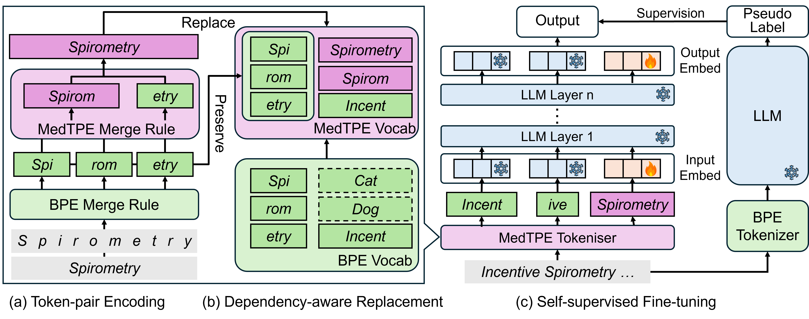

# From Byte Pair to Token Pair: Efficient Prompt Compression for Large Language



Large language models (LLMs) are promising for clinical prediction, but real-world EHRs often produce long token sequences that increase computational cost and even reduce performance. Existing approaches either add compression modules or drop information by removing tokens. We propose Medical Token-Pair Encoding (MedTPE), a layered extension of byte-pair encoding that merges frequent medical token pairs into composite tokens, enabling lossless compression without added complexity. MedTPE preserves vocabulary size, requires fine-tuning only 0.5% of LLM parameters with self-supervised learning. Experiments on two clinical datasets and multiple LLMs show that MedTPE reduces input length and inference time while maintaining or improving predictive accuracy and format compliance. MedTPE also remains robust across input context-length and supports efficient test-time scaling.


## Getting Started
### Prerequisites
This project needs the following prerequisites:
- Python 3.12+
- CUDA 12.4+
- PyTorch
- transformers
- vllm

### Installation
```bash
git clone <repo>
cd MedTPE
pip install -r requirements.txt
```

### 1. Download the SFT_QA Data
This step will be added after anonymious reviewing.


### 2. Download Pretrained LLM from Huggingface Hub
You need to login the huggingface hub before running the following code for model downloads
```bash
python demo_inference.py --repo_id meta-llama--Llama-3.2-1B-Instruct --local_dir data/hf_models
python demo_inference.py --repo_id Qwen--Qwen2.5-1.5B-Instruct --local_dir data/hf_models

# You can change the repo_id to download other pretrained LLMs
```

### 3. Create MedTPE fitted Model
You need to create the MedTPE tokeniser and fit the LLMs with the following codes:

```bash
# First, set your environment variables (replace paths as needed):
DATA_FORMAT="nl"
TASK="icu_mortality"
MODEL_PATH="data/hf_models/Qwen--Qwen2.5-1.5B-Instruct"
MAX_M=5000
MAX_N=3

# Create TPE tokenizer
python create_tpe_tokenizer.py --data_format $DATA_FORMAT --task $TASK --model_path $MODEL_PATH --max_m $MAX_M --max_n $MAX_N

# Fit TPE tokenizer
python llm_fit_tpe_tokenizer.py --data_format $DATA_FORMAT --task $TASK --model_path $MODEL_PATH --max_m $MAX_M --max_n $MAX_N
```

**Shortcut**: We provide a shell script that automates both steps above. Simply run:
```bash
sh/create_tpe_models.sh
```
By default, this will produce two directories:
- *data/tpe_tokenizer/* – the standalone TPE tokenizer artifacts
- *data/tpe_models/* – the original LLM plus new embeddings (ready for fine‐tuning)

### 4. Running the self-supervised fine-tuning.
Once you have your MedTPE‐augmented LLM in data/tpe_models/, perform self‐supervised fine‐tuning (SSFT) as follows.
```bash
# Set your variables (adjust paths as needed):
DATA_FORMAT="nl"
TASK="icu_mortality"
TPE_MODEL_PATH="data/tpe_models/Qwen2.5-1.5B-Instruct_task-icu_mortality_maxN-3_maxM-5000"
DATA_DIR="data/cleaned_SFT_QA"
TRAIN_FN="ssft"

# Launch SSFT
python llm_ssft.py --model_path "$TPE_MODEL_PATH" --task "$TASK" --data_dir "$DATA_DIR" --data_format "$DATA_FORMAT" --train_fn "$TRAIN_FN" 
```

**Shortcut**: Running the shell script
```bash
sh/llm_ssft.sh
```
After training completes, you’ll find the fine‐tuned checkpoint(s) in *data/sft_models*. These behave just like any other pretrained LLM checkpoint and can be loaded for inference.

### 6. Run inference demo with VLLM.
With your MedTPE + SSFT model ready, you can test it against an example prompt via VLLM. For instance:
```bash
python demo_inference.py --model_name <original LLM path> --sft_model_name <MedTPE LLM path>
```

## Reproduce Our Results

Follow these structured steps to reproduce the experimental results described in our paper. Ensure you've completed all the steps under Getting Started before proceeding.

### RQ1: Evaluate the Effectiveness of MedTPE

This experiment assesses the capability of LLM with MedTPE. We also include the LLMLingua2 as the baseline.

Run:
```
sh llm_infer_exp1_tpe.sh  # Approximate runtime: 20 hours (GPU-dependent)
sh parse_result_llm_exp1_tpe.sh
```

### RQ2: Evaluate Computational Costs of Integrating MedTPE

This evaluation measures the computational overhead introduced by MedTPE integration.

Run:
```
sh exp2_cost.sh
```
### RQ3: Evaluate Context-length Robustness

Assess how robust MedTPE-enhanced models are to variations in input context length.

Run:
```
sh llm_infer_exp3_context_len.sh  # Approximate runtime: 20-40 hours (GPU-dependent)
sh parse_result_llm_exp3_context_len.sh
```

### RQ4: Evaluate Test-time Scalability
Evaluate the MedTPE's potential with test-time scaling strategy. In our study, we use the majority voting as the test-time scaling method.

Run:
```
sh llm_infer_exp4_tts.sh  # Approximate runtime: 20-40 hours (GPU-dependent)
sh parse_result_llm_exp4_tts.sh
```
